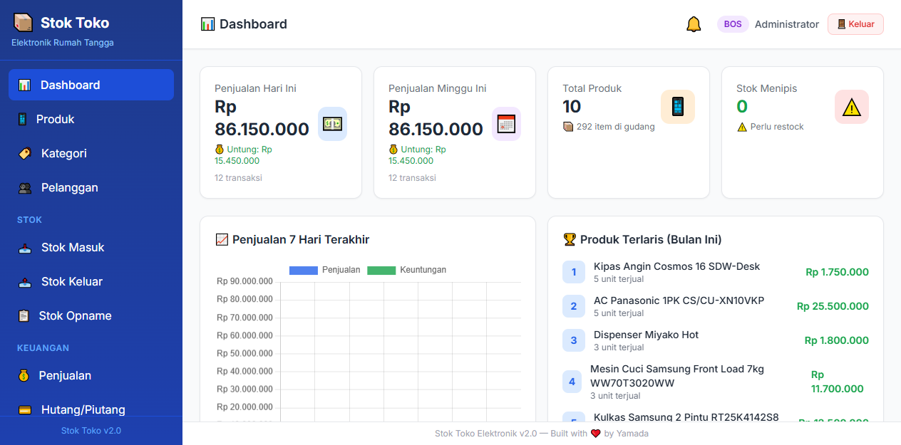

# 📦 Inventory Management System

> **Web-based Inventory & Sales Management System for Electronics Retail Stores**

A comprehensive web application for managing inventory, sales, and finances for home electronics retail stores. Built for store owners and employees to efficiently track stock, record transactions, and monitor profitability.

## ✨ Key Features

### 📊 Dashboard
- Daily, weekly, and monthly sales overview
- 7-day sales trend chart
- Top selling products this month
- Low stock alerts
- Recent stock mutations

### 📱 Product Management
- Full CRUD operations (Create, Read, Update, Delete)
- Product categories (TV, Refrigerator, Washing Machine, AC, etc.)
- Cost price & selling price tracking
- Minimum stock threshold & barcode support
- Price change history

### 📥 Stock In & Out
- Record incoming stock from suppliers
- Record outgoing stock (damaged, lost, returns)
- Auto stock update on sales
- Complete stock mutation history

### 💰 Sales & Invoicing
- Sales input with customer selection
- Automatic profit calculation
- Printable invoice/receipt
- Support for cash & credit payment methods

### 👥 Customer Management
- Complete customer data (name, address, phone)
- Transaction history per customer
- Customer receivables tracking

### 💳 Accounts Receivable
- Credit sales with automatic due dates (30 days)
- Partial/full payment tracking
- Due date notifications

### 📈 Profit Reports
- Daily, weekly, monthly reports
- Sales & profit charts
- Export to Excel (.xlsx)

### 🔐 Authentication & Roles
- Username & password login
- **Admin** role (full access) and **Employee** role (limited)
- User management (add, edit, delete)

### 💾 Backup & Restore
- Automatic database backup
- Restore from backup file
- Download backup files

### 📱 Responsive Design
- Responsive layout (desktop & mobile)
- Sidebar navigation
- Mobile-friendly interface

## 🛠️ Tech Stack

| Component | Technology |
|-----------|------------|
| **Backend** | Python FastAPI |
| **Database** | SQLite |
| **Frontend** | HTML, TailwindCSS, Alpine.js |
| **Charts** | Chart.js |
| **Export** | OpenPyXL (Excel) |
| **Server** | Uvicorn |

## 🚀 Installation

### 1. Clone Repository
```bash
git clone https://github.com/ozihatake77/inventory-management-system.git
cd inventory-management-system
```

### 2. Install Dependencies
```bash
pip install -r requirements.txt
```

### 3. Run Application
```bash
python app.py
```

### 4. Open Browser
```
http://localhost:8000
```

## 🔑 Default Login

| Role | Username | Password |
|------|----------|----------|
| **Admin** | `admin` | `admin123` |

## 📸 Screenshots

### Dashboard


### Product Management


### Sales


## 📁 Project Structure

```
inventory-management-system/
├── app.py                 # FastAPI backend (routes & logic)
├── requirements.txt       # Python dependencies
├── Procfile              # Railway deployment config
├── .gitignore            # Git ignore rules
├── static/               # Static files (CSS, JS, images)
└── templates/            # Jinja2 HTML templates
    ├── base.html         # Main layout (sidebar + header)
    ├── login.html        # Login page
    ├── dashboard.html    # Main dashboard
    ├── produk.html       # Product management
    ├── kategori.html     # Category management
    ├── pelanggan.html    # Customer management
    ├── stok_masuk.html   # Stock in
    ├── stok_keluar.html  # Stock out
    ├── opname.html       # Stock opname
    ├── penjualan.html    # Sales
    ├── nota.html         # Invoice printing
    ├── hutang.html       # Accounts receivable
    ├── laporan.html      # Profit reports
    ├── users.html        # User management
    ├── backup.html       # Backup & restore
    ├── notifikasi.html   # Notifications
    └── riwayat_harga.html # Price history
```

## 🎯 Target Users

- Home electronics retail stores
- Small & medium enterprises (SMEs)
- Freelance developers needing inventory apps

## 💡 Advantages

- ✅ **Free & Open Source** - No license fees
- ✅ **Easy to Use** - Intuitive interface
- ✅ **Responsive** - Accessible from mobile/tablet
- ✅ **Offline Ready** - Local SQLite database
- ✅ **Customizable** - Easy to modify as needed
- ✅ **Easy Deploy** - Works on Railway, VPS, or shared hosting

## 🌐 Live Demo

🔗 **[https://prototypepenjualan.up.railway.app](https://prototypepenjualan.up.railway.app)**

**Demo Credentials:**
- Username: `admin`
- Password: `admin123`

## 📞 Contact

**Developer:** Ozihatake  
**GitHub:** [@ozihatake77](https://github.com/ozihatake77)  
**Email:** ozihatake77@gmail.com

## 📄 License

MIT License - Free to use and modify as needed.

---

**Built with ❤️ by Yamada for Ozihatake**
